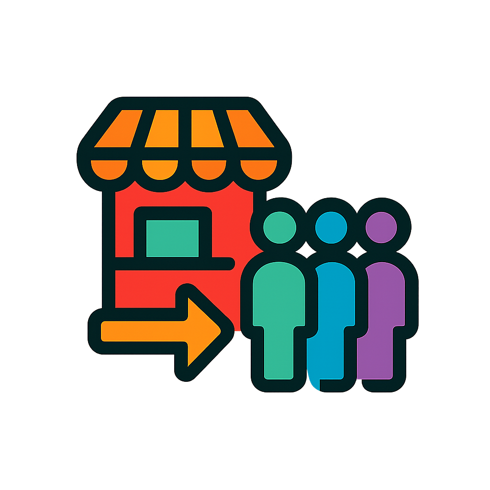

# Shop Queue System

  

  ระบบจัดการคิวร้านค้าอัจฉริยะ | Smart Shop Queue Management System

## 📋 ภาพรวมโครงการ (Project Overview)

Shop Queue System เป็นแพลตฟอร์มจัดการคิวสำหรับร้านค้าและธุรกิจขนาดเล็กถึงขนาดกลาง ช่วยให้ร้านค้าสามารถจัดการลูกค้าได้อย่างมีประสิทธิภาพ ลดความแออัด และเพิ่มความพึงพอใจของลูกค้า ระบบถูกพัฒนาด้วย Next.js, Tailwind CSS และ Supabase โดยใช้หลักการ Clean Architecture และ SOLID principles

## ✨ ฟีเจอร์หลัก (Key Features)

### 🏪 สำหรับเจ้าของร้าน

- **จัดการร้านค้า**: สร้างและจัดการข้อมูลร้านค้า รวมถึงชื่อ ที่อยู่ และคำอธิบาย
- **QR Code สำหรับร้าน**: ระบบสร้าง QR Code ให้ลูกค้าสแกนเพื่อเข้าคิว
- **แดชบอร์ดแบบเรียลไทม์**: ติดตามสถานะคิวและการให้บริการแบบเรียลไทม์
- **จัดการพนักงาน**: กำหนดสิทธิ์และบทบาทให้พนักงานในร้าน
- **โปรโมชันและแต้มสะสม**: สร้างและจัดการโปรโมชัน รวมถึงระบบแต้มสะสม

### 🧑‍💼 สำหรับพนักงาน

- **จัดการคิว**: เรียกคิว อัปเดตสถานะ และบันทึกข้อมูลการให้บริการ
- **บันทึกการชำระเงิน**: จัดการข้อมูลการชำระเงินของลูกค้า
- **แจ้งเตือน**: ระบบแจ้งเตือนเมื่อมีคิวใหม่หรือต้องดำเนินการ
- **ข้อความแนะนำ**: มีข้อความแนะนำสำเร็จรูปสำหรับบันทึกในคิว

### 👥 สำหรับลูกค้า

- **จองคิวออนไลน์**: จองคิวล่วงหน้าหรือเข้าคิวผ่านการสแกน QR Code
- **ติดตามสถานะคิว**: ดูสถานะคิวและเวลารอโดยประมาณ
- **รับการแจ้งเตือน**: รับแจ้งเตือนเมื่อใกล้ถึงคิว
- **ประวัติการใช้บริการ**: ดูประวัติการใช้บริการและแต้มสะสม
- **ให้คะแนนบริการ**: ประเมินความพึงพอใจหลังใช้บริการ

## 🔄 สถานะคิวและการชำระเงิน

### สถานะคิว

- **รอยืนยัน (Waiting)**: คิวที่ยังไม่ได้รับการยืนยัน
- **ยืนยันแล้ว (Confirmed)**: คิวที่ได้รับการยืนยันและกำลังรอรับบริการ
- **ให้บริการแล้ว (Served)**: คิวที่ได้รับบริการเรียบร้อยแล้ว
- **ยกเลิก (Canceled)**: คิวที่ถูกยกเลิก

### สถานะการชำระเงิน

- **ยังไม่ชำระ (Unpaid)**: ยังไม่มีการชำระเงิน
- **ชำระบางส่วน (Partial)**: ชำระเงินบางส่วนแล้ว
- **ชำระเรียบร้อย (Paid)**: ชำระเงินครบถ้วนแล้ว

## 💼 ประโยชน์ที่ได้รับ

- **ลดเวลารอคอย**: ลูกค้าไม่จำเป็นต้องยืนรอในแถว สามารถทำกิจกรรมอื่นระหว่างรอคิว
- **เพิ่มประสิทธิภาพ**: ร้านค้าสามารถจัดการลูกค้าได้อย่างมีระบบและมีประสิทธิภาพมากขึ้น
- **ข้อมูลเชิงลึก**: เก็บข้อมูลการใช้บริการเพื่อวิเคราะห์และปรับปรุงธุรกิจ
- **สร้างความประทับใจ**: เพิ่มความพึงพอใจของลูกค้าด้วยระบบที่ทันสมัย
- **ลดความผิดพลาด**: ลดความผิดพลาดจากการจัดการคิวด้วยมือ

## 🚀 การเริ่มต้นใช้งาน

### สำหรับเจ้าของร้าน

1. ลงทะเบียนและสร้างบัญชีผู้ใช้
2. สร้างโปรไฟล์ร้านค้าและกรอกข้อมูลร้าน
3. ตั้งค่าระบบคิวตามความต้องการของร้าน
4. เพิ่มพนักงานและกำหนดสิทธิ์
5. เริ่มใช้งานระบบคิว!

### สำหรับลูกค้า

1. สแกน QR Code ที่ร้านค้า หรือเข้าสู่เว็บไซต์
2. กรอกข้อมูลส่วนตัว (ชื่อ, เบอร์โทร)
3. รับหมายเลขคิวและติดตามสถานะ
4. รับการแจ้งเตือนเมื่อใกล้ถึงคิว

## 🛠️ เทคโนโลยีที่ใช้

- **Frontend**: Next.js, React, Tailwind CSS
- **Backend**: Next.js API Routes, Supabase Functions
- **Database**: Supabase (PostgreSQL)
- **Authentication**: Supabase Auth
- **Realtime**: Supabase Realtime
- **Hosting**: Vercel

## 📱 การรองรับอุปกรณ์

ระบบรองรับการใช้งานบนอุปกรณ์ทุกประเภท:

- 💻 Desktop
- 📱 Mobile
- 📟 Tablet

---

  พัฒนาด้วย ❤️ โดยทีม Shop Queue

